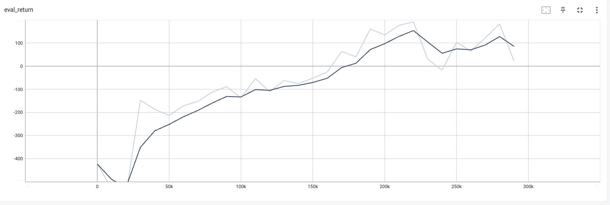
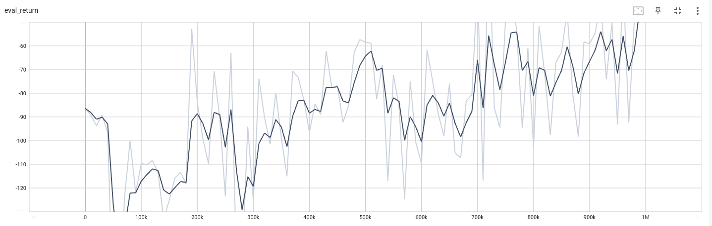

#  **BipedalWalker and Lunar Lander RL Algorithms**

<p align="center">
  
  
</p>

This repository contains implementations of various reinforcement learning algorithms (DQN, DDQN TD3, PPO) for solving the Lunar Lander-v2 and BipedalWalker-v3 environment from OpenAI's Gym. 

##  **Algorithms Implemented**

- **DQN** (Deep Q-Network)
- **DDQN** (Double Deep Q-Netowork)
- **TD3** (Twin Delayed Deep Deterministic Policy Gradient)
- **PPO** (Proximal Policy Optimization)


##  **Getting Started**

### 1. **Clone the Repository**

```bash
git clone https://github.com/Viswesh-N/RL_BipedWalker.git
cd RL_BipedWalker
```

### 2. **Set Up the Environment**

It’s recommended to use a virtual environment for managing dependencies.

```bash
python -m venv env
source env/bin/activate  # On Windows use `env\Scripts\activate`
```

### 3. **Install Dependencies**

Before running any commands, ensure you install all required Python packages.

```bash
pip install -r requirements.txt
```

### 4. **Set Up the Python Path**

To ensure that imports aren't broken, run the following command in the root directory of the repository:

```bash
export PYTHONPATH=$(pwd)
```

### 5. **Running the Algorithms**

#### **DQN**

Train the DQN or DDQN agent on the LunarLander-v2 environment:

```bash
python scripts/run.py --algo dqn --config_file experiments/dqn/dqn_config.yaml --seed 1 --eval_interval 10000 --num_eval_trajectories 10 --num_render_trajectories 0 --log_interval 1000
```

To run the DDQN agent, simply use the ddqn_config.yaml file in place of the dqn_config.yaml file. No other change is required.

#### **TD3**

Train the TD3 agent on the BipedalWalker-v3 environment:

```bash
python scripts/run.py --algo td3 --config_file experiments/td3/td3_config.yaml --seed 1 --eval_interval 10000 --num_eval_trajectories 10 --num_render_trajectories 0 --log_interval 1000
```

#### **PPO**

Train the PPO agent on the BipedalWalker-v3 environment:

```bash
python scripts/run.py --algo ppo --config_file experiments/ppo/ppo_config.yaml --seed 1 --eval_interval 10000 --num_eval_trajectories 10 --num_render_trajectories 0 --log_interval 1000
```
### 6. **Logging and Visualization**

Training logs are stored in the `data/` directory, organized by algorithm name, environment, and timestamp. You can visualize the training progress using TensorBoard:

```bash
tensorboard --logdir data/
```

Open [http://localhost:6006](http://localhost:6006) in your browser to view the logs.

### 7. **Viewing Training Progress**

You can view the plots for DQN and TD3 training in the `images/` directory.

- **DQN Plot**: 
- **TD3 Plot**: 


### 8. **Customization**

You can modify the configurations in the `experiments/` folder to change hyperparameters, learning rates, or other settings specific to each algorithm.

### 9. **Known Issues**

- **LiDAR Raycasting Error**: Sometimes, during training, you might encounter a `r.LengthSquared() > 0.0f` error due to numerical instability in the physics engine. The environment automatically resets when this occurs.


